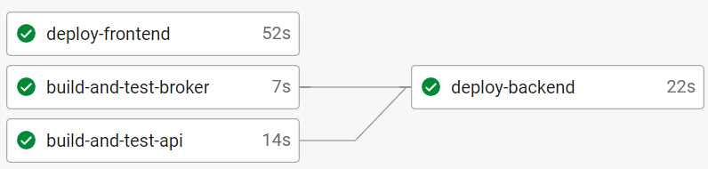

# Correr aplicación en ambiente local

Para correr la aplicación en un ambiente local se debe correr tanto el backend como el frontend. 

## Frontend:

Para correr el frontend se debe tener instalado Node.js con una version mayor a la 14. Vamos a la carpeta frontend y lo primero que tenemos que hacer es `npm install`. Luego de esto tenemos que crear el build con `npm run build` y finalmente iniciar la app con `npm run start`. Con esto ya tendremos corriendo el frontend en `localhost:3000`.

## Backend:

Para poder correr el backend se debe tener instalado docker. El archivo .env neceario para poder correr es del estilo del archivo `example.env` que se encuentra en el directorio de backend y en los subdirectorios: broker y ticker_seller, donde lo que se debe cambiar DB_USERNAME y DB_PASSWORD segun los datos que se quieran ocupar para crear la base de datos de postgres. Asumiendo que se tiene instalado docker, lo que el usuario debe hacer es situarse en la carpeta backend y correr los comandos `docker-compose build` y luego `docker-compose up`*. Con esto estaria corriendo ya el script del broker y el backend. Esto dejaria corriendo el backend en el `localhost:8000`.

* Nota. Los comandos de docker compose pueden variar de computador a computador, en algunas versiones es `docker compose build` y luego `docker compose up`

# Pasos CI/CD

Actualmente, nuestro workflow posee dos pipelines principales: el pipeline para frontend y el pipeline para backend.

En primer lugar, el pipeline para frontend solo consiste de un job que corresponde al deploy. Este job hace un nuevo build del frontend y lo sube a la instancia de S3 e invalida el cache de CloudFront.

En segundo lugar, el pipeline para backend está compuesto por tres jobs, los cuales son `build-and-test-api`, `build-and-test-broker` y `deploy-backend`. Los dos primeros se encargan de realizar un build y correr tests tanto para la API como para el cliente del broker del curso. En el build de ambos componentes se utiliza una imagen de node y otra de postgresql (junto a sus variables de entorno). Luego, se ejecuta un checkout para copiar los archivos del repositorio al container docker y, por último, se instalan dependencias y se corren las migraciones. El tercer job, como su nombre indica, realiza el deploy de todo el backend a la instancia EC2 por medio de CodeDeploy. Este último job, solo se ejecuta si los dos anteriores son llevados a cabo con éxito.

Finalmente, ambos deploys son realizados utilizando `aws-cli`. Para poder hacer esto, se necesita especificar las `ACCESS_KEYS`, de un usuario que tenga los permisos para realizar cambios en CodeDeploy y S3, en `Organization Settings/Contexts`. Asimismo, estos jobs solo se ejecutan si el commit que gatilla los pipelines proviene de la rama master.

Para el caso de CodeDeploy, los pasos que sigue cuando se crea un nuevo deploy son: parar los containers con `docker compose stop`, añadir los cambios con `docker compose build` y `docker compose up -d`, y Validar que funcione correctamente con `docker compose ps`.

Todo lo mencionado anteriormente se encuentra detallado en los archivos:

- `.circleci/config.yml` para la configuración del pipeline CI y CD del frontend.
- `appspec.yml` para la configuración de CodeDeploy y CD del backend.

# Paso a paso Serverless:

Primero se debe instalar el serverless de forma global y las librerías necesarias (Amazon Web Services Software Development Kit y pdfkit) a traves de los comandos en consola de `npm install -g serverless` y `npm install --save aws-sdk pdfkit`. Luego se crea un proyecto base en serverless a traves del codigo en consola `serverless create --template aws-nodejs`. Se debe configurar un rol para que el serverlessjs tenga los permisos necesarios para hacer cambios en aws. Luego de conceder los permisos se guardan las keys en local, para que el serverless tenga acceso a aws. Después de esto se debe modificar el archivo handler.js para dejarlo con la función lambda y el codigo de serverless.yml que se encuentra dentro del proyecto, el cual contiene las instrucciones para detectar los eventos que hacen el triggerde la función lambda (a traves de un post al api gateaway). Luego de que la función lambda genere el pdf, este se gurada en la instancia S3 y manda un response con el link del pdf correspondiente. Despues, para poder deployarlo a aws se debe usar el comando de serverless `serverless deploy` que lo sube automaticamente. Este comando tambien crea automaticamente el API gateway y la función lambda. Es importante que para cualquier cambio en el codigo hay que correr nuevamente el cmando `serverless deploy`.

# Documentacion rutas api:

Estas se hicieron a traves de postman y se encuentran en un json standard generados por dicha aplicacion con nombre api.ticketseller.lat.postman_collection.json

# Flujos y pasos IaaC:

Para la configuración de IaaC ocupamos la herramienta de Terraform. Con esta herramienta configuramos las infraestructura de la instancia S3 junto a sus buckets, el cloudfront, el EC2, las funciones lambda utilizadas y las API Gateway asociadas a cada función lambda. Primero lo que hacemos con terraform es implementar el provider de aws para que pueda vincularse con nuestro servidor de Amazon. Luego se crean configuran las instancias anteriormente mencionadas, en el orden en que se mencionaron y se crean en nuestro servidor de aws. El flujo en consola para que corra lo anteriormente mencionado es el siguiente: 1- `terraform init` 2- `terraform validate` 3-`terraform plan -out deployment.tfplan` 4-`terraform apply "deployment.tfplan"`. Las instancias se detallan aca:

## S3:
Esta instancia de S3 contiene dos buckets los cuales son "frontend-grupo7" y "pdf-grupo7". Estos se ven representados en el `main.tf` como los modulos "s3-frontend" y "s3-pdf" respectivamente.

## Cloudfront:
Estainstancia corresponde al cloudfront que esta conectado con el frontend de nuestra app, se ve representado por el modulo `Cloudfront`.

## EC2:
En esta instancia se encuentra el backend de la aplicación. Esta está representada por el modulo "ticketseller-ec2" en terraform. En el archovo de terraform asociado a esta instancia se configuran los datos necesarios para que corra como el `instance_type`, `key_name`, `ami`, entre otros.

## Funciones Lambda:
Para nuestra aplicación tenemos dos funciones lambdas. Una de estas funciones es para el `user-validation` y es representada por el modulo `user-validation-lambda` en el `main.tf`. Luego tenemos la función lambda asociada a la creación del pdf la cual esta representada por el modulo `pdf-lambda`. Con la herramienta de terraform lo que hacemos es pasarle el archivo .zip asociado a cada función para que se instancie en aws.

## API Gateway:
Para nuestra aplicación tenemos dos instancias de API Gateway, una para cada función lambda correspondiente. Estas estan representadas por los modulos `tickets-api-gateway` y `pdf-api-gateway`.